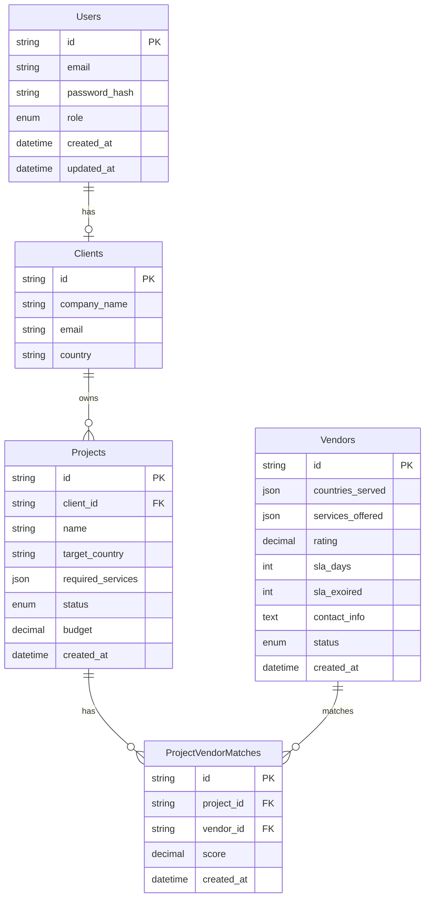

p align="center"> <a href="http://nestjs.com/" target="blank">  </a> </p> <p align="center"> A progressive <strong>NestJS-based backend</strong> designed for <strong>Expander360</strong>, a platform that helps businesses manage global expansion projects. The system connects clients, vendors, projects, unstructured research documents, and analytics across MySQL and MongoDB. </p> <p align="center"> <a href="https://www.npmjs.com/~nestjscore" target="_blank">  </a> <a href="https://www.npmjs.com/~nestjscore" target="_blank">  </a> <a href="https://discord.gg/G7Qnnhy" target="_blank">  </a>  </p> --- ## 📌 Features - 🔐 **JWT Authentication & RBAC** → Roles: client & admin - 🗄 **Relational + Non-Relational DB Integration** → MySQL + MongoDB - 📁 **Research Document Management** → Upload, search, and fetch reports - 🤝 **Project-Vendor Matching Algorithm** → Based on country, services, rating, and SLA - 📊 **Analytics API** → Combines MySQL + MongoDB insights - 📬 **Email Notifications** → When new matches are generated - ⏳ **Scheduled Jobs** → Auto-refresh matches & flag expired SLAs - 🐳 **Dockerized Setup** → MySQL, MongoDB, Redis, and API containers - 🚀

## 🚀 🛠 Tech Stack

| Layer         | Technology              |
| ------------- | ----------------------- |
| Framework     | NestJS (TypeScript)     |
| Auth          | JWT + Role Guards       |
| Relational DB | MySQL (TypeORM)         |
| NoSQL DB      | MongoDB (Mongoose)      |
| Cache/Queues  | Redis + BullMQ          |
| File Storage  | MongoDB GridFS          |
| Scheduling    | NestJS Scheduler/BullMQ |
| Deployment    | Docker + Docker Compose |

# 3. Start all services

docker-compose up -d

# 4. Run database migrations

docker-compose exec api npm run migration:run
docker-compose exec api npm run seed

# 5. API will be available at http://localhost:3000

### 📋 Manual Setup

bash
# 1. Install dependencies

```bash
npm install
```

# 5. Start the development server

```bash
npm run start:dev
```

---

## 📂 Project Structure

```
src/
├── admin/        # Creating vendors
├── auth/         # Authentication module
├── users/        # User management
├── clients/      # Client profiles
├── projects/     # Project management
├── vendors/      # Vendor management
├── matches/      # Vendor matching algorithm
├── documents/    # Document management (MongoDB)
├── email/        # Email notifications
├── scheduler/    # Scheduled jobs (BullMQ)
├── common/       # Shared utilities
└── database/     # Database configuration
```



# Register new user

curl -X POST http://localhost:3000/auth/signup \

# Login

curl -X POST http://localhost:3000/auth/login \

### all other enpoints in controllers

### Project Management

bash

# Create project

curl -X POST http://localhost:3000/projects/create-projects \

# Generate vendor matches

curl -X POST http://localhost:3000/:id/matches/rebuild \
 -H "Authorization: Bearer YOUR_JWT_TOKEN"
--- ## 🤝 Contributing 1. Fork the repository 2. Create a feature branch (git checkout -b feature/amazing-feature) 3. Commit your changes (git commit -m 'Add amazing feature') 4. Push to the branch (git push origin feature/amazing-feature) 5. Open a Pull Request ### Development Guidelines - Follow TypeScript best practices - Write unit tests for new features - Update documentation for API changes - Use conventional commit messages - Ensure all tests pass before submitting PR --- ## 📄 License This project is licensed under the MIT License - see the [LICENSE](LICENSE) file for details. --- ## 📞 Support - **Author**: [Your Name](https://github.com/your-username) - **Website**: [https://expander360.com](https://expander360.com) - **Email**: [support@expander360.com](mailto:support@expander360.com) - **Documentation**: [API Docs](https://your-api-docs.com) --- ## 🙏 Acknowledgments - [NestJS](https://nestjs.com/) - Progressive Node.js framework - [TypeORM](https://typeorm.io/) - Amazing ORM for TypeScript - [Mongoose](https://mongoosejs.com/) - MongoDB object modeling - [BullMQ](https://bullmq.io/) - Premium Queue package --- <p align="center"> Made with ❤️ for global expansion </p>
