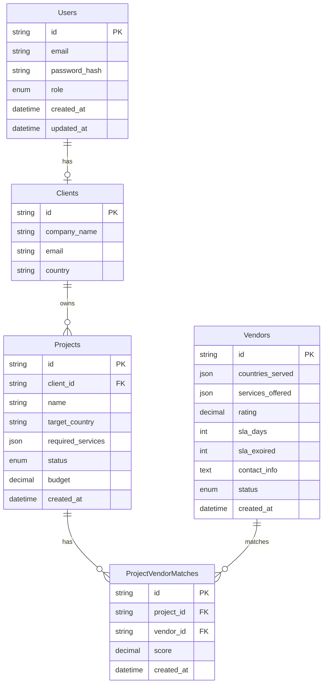

p align="center"> <a href="http://nestjs.com/" target="blank">  </a> </p> <p align="center"> A progressive <strong>NestJS-based backend</strong> designed for <strong>Expander360</strong>, a platform that helps businesses manage global expansion projects. The system connects clients, vendors, projects, unstructured research documents, and analytics across MySQL and MongoDB. </p> <p align="center"> <a href="https://www.npmjs.com/~nestjscore" target="_blank">  </a> <a href="https://www.npmjs.com/~nestjscore" target="_blank">  </a> <a href="https://discord.gg/G7Qnnhy" target="_blank">  </a>  </p> --- ## 📌 Features - 🔐 **JWT Authentication & RBAC** → Roles: client & admin - 🗄 **Relational + Non-Relational DB Integration** → MySQL + MongoDB - 📁 **Research Document Management** → Upload, search, and fetch reports - 🤝 **Project-Vendor Matching Algorithm** → Based on country, services, rating, and SLA - 📊 **Analytics API** → Combines MySQL + MongoDB insights - 📬 **Email Notifications** → When new matches are generated - ⏳ **Scheduled Jobs** → Auto-refresh matches & flag expired SLAs - 🐳 **Dockerized Setup** → MySQL, MongoDB, Redis, and API containers - 🚀

## 🚀 🛠 Tech Stack

| Layer         | Technology                        |
| ------------- | --------------------------------- |
| Framework     | NestJS (TypeScript)               |
| Auth          | JWT + Role Guards                 |
| Relational DB | MySQL (TypeORM)                   |
| NoSQL DB      | MongoDB (Mongoose)                |
| Cache/Queues  | Redis + BullMQ                    |
| File Storage  | MongoDB GridFS                    |
| Scheduling    | NestJS Scheduler/BullMQ           |
| Deployment    | railway + Docker + Docker Compose |

```

```

## 🚀 Deployment

| Description          | URL                                                                                                              |
| -------------------- | ---------------------------------------------------------------------------------------------------------------- |
| **Base URL**         | [https://exp-task-production-f253.up.railway.app](https://exp-task-production-f253.up.railway.app)               |
| **Example Endpoint** | [https://exp-task-production-f253.up.railway.app/vendor](https://exp-task-production-f253.up.railway.app/vendor) |

```

```

# 3. Start all services

docker-compose up -d

# 4. Run database migrations

docker-compose exec api npm run migration:run
docker-compose exec api npm run seed

# 5. API will be available at http://localhost:3000

### 📋 Manual Setup

bash

# 1. Install dependencies

```bash
npm install
```

# 5. Start the development server

```bash
npm run start:dev
```

---

## 📂 Project Structure

```
src/
├── admin/        # Creating vendors
├── auth/         # Authentication module
├── users/        # User management
├── clients/      # Client profiles
├── projects/     # Project management
├── vendors/      # Vendor management
├── matches/      # Vendor matching algorithm
├── migrations    # migrations to vendor entity
├── documents/    # Document management (MongoDB)
├── email/        # Email notifications
├── scheduler/    # Scheduled jobs (BullMQ)
├── common/       # Shared utilities
└── database/     # Database configuration
```



# Register new user

```
 POST http://localhost:3000/auth/signup \
```

# Login

```
  POST http://localhost:3000/auth/login \
```


### Project Management

# Create project
```
curl -X POST http://localhost:3000/projects/create-projects \
```

### all other endpoints in controllers

### to run mongo-seed script

```bash
npx ts-node src/seed/mongo-seed.ts
```

# Generate vendor matches

curl -X POST http://localhost:3000/:id/matches/rebuild \

## 🤝 Contributing

We welcome contributions to enhance this project! Please follow these steps:

1.  **Fork** the repository.
2.  Create a **feature branch** with a descriptive name (e.g., `feature/new-api-endpoint`).
3.  **Commit** your changes with clear, concise messages.
4.  **Push** your branch to your forked repository.
5.  Submit a **pull request** to the main branch of this repository.

### Development Standards

- Adhere to **TypeScript best practices** for code quality and maintainability.
- Maintain up-to-date **documentation** for any API modifications.
- Use **conventional commit messages** for clarity and automation.
- Ensure **all tests pass** before submitting a pull request.

---

## 🙏 Acknowledgments

We extend our sincere gratitude to the following projects and communities that have made this project possible:

- **NestJS:** A progressive Node.js framework for building efficient, scalable, and reliable server-side applications.
- **TypeORM:** An Object-Relational Mapper (ORM) for TypeScript and JavaScript that simplifies database interactions.
- **Mongoose:** An elegant MongoDB object modeling tool designed to work in an asynchronous environment.
- **BullMQ:** A robust and efficient queue system for Node.js, providing advanced features for background processing.

---
