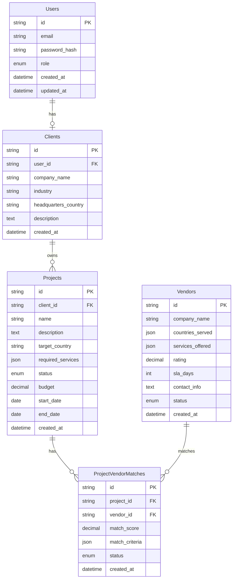

# 🌎 Global Expansion Management API

<p align="center">
  <a href="http://nestjs.com/" target="blank">
    
  </a>
</p>

<p align="center">
  A progressive <strong>NestJS-based backend</strong> designed for <strong>Expander360</strong>, a platform that helps businesses manage global expansion projects. The system connects clients, vendors, projects, unstructured research documents, and analytics across MySQL and MongoDB.
</p>

<p align="center">
  <a href="https://www.npmjs.com/~nestjscore" target="_blank">
    
  </a>
  <a href="https://www.npmjs.com/~nestjscore" target="_blank">
    
  </a>
  <a href="https://discord.gg/G7Qnnhy" target="_blank">
    
  </a>
  
</p>

---

## 📌 Features

- 🔐 **JWT Authentication & RBAC** → Roles: client & admin
- 🗄 **Relational + Non-Relational DB Integration** → MySQL + MongoDB
- 📁 **Research Document Management** → Upload, search, and fetch reports
- 🤝 **Project-Vendor Matching Algorithm** → Based on country, services, rating, and SLA
- 📊 **Analytics API** → Combines MySQL + MongoDB insights
- 📬 **Email Notifications** → When new matches are generated
- ⏳ **Scheduled Jobs** → Auto-refresh matches & flag expired SLAs
- 🐳 **Dockerized Setup** → MySQL, MongoDB, Redis, and API containers
- 🚀 **Cloud Ready** → Deploy to **Render**, **Railway**, or **AWS Free Tier**

---

## 🛠 Tech Stack

| Layer | Technology |
|-------------|-----------|
| Framework | NestJS (TypeScript) |
| Auth | JWT + Role Guards |
| Relational DB | MySQL (TypeORM) |
| NoSQL DB | MongoDB (Mongoose) |
| Cache / Queues | Redis + BullMQ |
| File Storage | MongoDB GridFS |
| Scheduling | NestJS Scheduler / BullMQ |
| Deployment | Docker + Docker Compose |

---

## 🚀 Quick Start

### Prerequisites

- Node.js (v18 or higher)
- Docker & Docker Compose (recommended)
- MySQL (v8 or higher)
- MongoDB (v5 or higher)
- Redis (v6 or higher)

### 🐳 Docker Setup (Recommended)

```bash
# 1. Clone the repository
git clone https://github.com/your-username/global-expansion-api.git
cd global-expansion-api

# 2. Set up environment variables
cp .env.example .env
# Edit .env with your configuration

# 3. Start all services
docker-compose up -d

# 4. Run database migrations
docker-compose exec api npm run migration:run
docker-compose exec api npm run seed

# 5. API will be available at http://localhost:3000
```

### 📋 Manual Setup

```bash
# 1. Install dependencies
npm install

# 2. Configure environment variables
cp .env.example .env

# 3. Set up databases (MySQL, MongoDB, Redis)
# Update .env with your database URLs

# 4. Run migrations and seed data
npm run migration:run
npm run seed

# 5. Start the development server
npm run start:dev
```

---

## 📂 Project Structure

```
src/
├── auth/                   # Authentication module
│   ├── guards/            # JWT & Role guards
│   ├── strategies/        # Passport strategies
│   └── dto/              # Auth DTOs
├── users/                 # User management
├── clients/               # Client profiles
├── projects/              # Project management
├── vendors/               # Vendor management
├── matching/              # Vendor matching algorithm
├── documents/             # Document management (MongoDB)
├── analytics/             # Analytics & reporting
├── notifications/         # Email notifications
├── jobs/                  # Scheduled jobs (BullMQ)
├── common/                # Shared utilities
│   ├── decorators/       # Custom decorators
│   ├── filters/          # Exception filters
│   ├── guards/           # Global guards
│   └── interceptors/     # Response interceptors
└── database/              # Database configuration
    ├── entities/         # TypeORM entities
    ├── migrations/       # Database migrations
    └── seeds/            # Seed data
```

---

## 🗄 Database Schema

### MySQL (Relational Data)



### MongoDB (Document Data)

```json
// Research Documents Collection
{
  "_id": "ObjectId",
  "project_id": "string",
  "title": "string",
  "document_type": "market_research | competitor_analysis | regulatory",
  "content": "string",
  "metadata": {
    "country": "string",
    "industry": "string",
    "tags": ["string"],
    "source": "string"
  },
  "file_id": "GridFS_ObjectId",
  "created_at": "Date",
  "updated_at": "Date"
}

// Analytics Events Collection
{
  "_id": "ObjectId",
  "project_id": "string",
  "event_type": "match_generated | vendor_contacted | project_milestone",
  "data": {
    "vendor_id": "string",
    "match_score": "number",
    "milestone": "string",
    "metrics": {}
  },
  "timestamp": "Date",
  "user_id": "string"
}
```


## 📡 API Documentation

### Authentication Endpoints

| Method | Endpoint | Description | Auth |
|--------|----------|-------------|------|
| POST | `/auth/register` | Register new user | ❌ |
| POST | `/auth/login` | User login | ❌ |
| POST | `/auth/refresh` | Refresh JWT token | ✅ |
| GET | `/auth/profile` | Get user profile | ✅ |

### Project Management

| Method | Endpoint | Description | Auth |
|--------|----------|-------------|------|
| GET | `/projects` | List user projects | ✅ |
| POST | `/projects` | Create new project | ✅ |
| GET | `/projects/:id` | Get project details | ✅ |
| PUT | `/projects/:id` | Update project | ✅ |
| DELETE | `/projects/:id` | Delete project | ✅ |

### Vendor Management

| Method | Endpoint | Description | Auth |
|--------|----------|-------------|------|
| GET | `/vendors` | List all vendors | ✅ |
| POST | `/vendors` | Add new vendor (admin) | ✅ |
| GET | `/vendors/:id` | Get vendor details | ✅ |
| PUT | `/vendors/:id` | Update vendor (admin) | ✅ |

### Matching System

| Method | Endpoint | Description | Auth |
|--------|----------|-------------|------|
| POST | `/matching/generate/:projectId` | Generate vendor matches | ✅ |
| GET | `/matching/project/:projectId` | Get project matches | ✅ |
| PUT | `/matching/:matchId/status` | Update match status | ✅ |

### Document Management

| Method | Endpoint | Description | Auth |
|--------|----------|-------------|------|
| POST | `/documents/upload` | Upload research document | ✅ |
| GET | `/documents/project/:projectId` | Get project documents | ✅ |
| GET | `/documents/:id/download` | Download document | ✅ |
| POST | `/documents/search` | Search documents | ✅ |

### Analytics

| Method | Endpoint | Description | Auth |
|--------|----------|-------------|------|
| GET | `/analytics/dashboard` | Get dashboard metrics | ✅ |
| GET | `/analytics/project/:projectId` | Project analytics | ✅ |
| GET | `/analytics/vendor-performance` | Vendor performance metrics | ✅ |

---

## 🤖 Vendor Matching Algorithm

Our intelligent matching algorithm evaluates vendors based on multiple criteria:

### Matching Formula

```typescript
final_score = (
  country_match * 0.35 +
  service_overlap * 0.30 +
  rating_score * 0.20 +
  sla_score * 0.15
) * 100
```

### Scoring Criteria

- **Country Match (35%)**: Exact match required
- **Service Overlap (30%)**: Jaccard similarity coefficient
- **Rating Score (20%)**: Normalized vendor rating (0-1)
- **SLA Score (15%)**: Inverse time preference

### Example Calculation

```
Project needs: Germany, [Legal, Marketing]
Vendor offers: Germany, [Legal, Marketing, Finance]

• Country: 1.0 (exact match)
• Services: 0.67 (2/3 overlap)
• Rating: 0.85 (4.25/5 stars)
• SLA: 0.80 (fast response)

Final Score: 82.5%
```

---


# Application Configuration
NODE_ENV="development"
PORT="3000"
API_PREFIX="api/v1"

# Matching Algorithm Configuration
MATCHING_THRESHOLD="0.6"
MAX_MATCHES_PER_PROJECT="10"

# Job Queue Configuration
QUEUE_REDIS_URL="redis://localhost:6379"
QUEUE_DEFAULT_JOB_OPTIONS="{\"removeOnComplete\":100,\"removeOnFail\":50}"
```

---

### AWS Free Tier

1. Launch EC2 instance
2. Set up RDS (MySQL) and DocumentDB (MongoDB)
3. Configure ElastiCache (Redis)
4. Deploy using Docker

---

## 🧪 Testing

```bash
# Unit tests
npm run test

# Integration tests
npm run test:e2e

# Test coverage
npm run test:cov

# Watch mode
npm run test:watch
```

---

## 📝 API Usage Examples

### Authentication

```bash
# Register new user
curl -X POST http://localhost:3000/api/v1/auth/register \
  -H "Content-Type: application/json" \
  -d '{
    "email": "user@example.com",
    "password": "securePassword123",
    "role": "client"
  }'

# Login
curl -X POST http://localhost:3000/api/v1/auth/login \
  -H "Content-Type: application/json" \
  -d '{
    "email": "user@example.com",
    "password": "securePassword123"
  }'
```

### Project Management

```bash
# Create project
curl -X POST http://localhost:3000/api/v1/projects \
  -H "Authorization: Bearer YOUR_JWT_TOKEN" \
  -H "Content-Type: application/json" \
  -d '{
    "name": "Germany Expansion",
    "description": "Expanding operations to Germany",
    "target_country": "Germany",
    "required_services": ["Legal", "Marketing", "HR"],
    "budget": 150000,
    "start_date": "2024-01-01",
    "end_date": "2024-12-31"
  }'

# Generate vendor matches
curl -X POST http://localhost:3000/api/v1/matching/generate/PROJECT_ID \
  -H "Authorization: Bearer YOUR_JWT_TOKEN"
```

---

## 🤝 Contributing

1. Fork the repository
2. Create a feature branch (`git checkout -b feature/amazing-feature`)
3. Commit your changes (`git commit -m 'Add amazing feature'`)
4. Push to the branch (`git push origin feature/amazing-feature`)
5. Open a Pull Request

### Development Guidelines

- Follow TypeScript best practices
- Write unit tests for new features
- Update documentation for API changes
- Use conventional commit messages
- Ensure all tests pass before submitting PR

---

## 📄 License

This project is licensed under the MIT License - see the [LICENSE](LICENSE) file for details.

---
